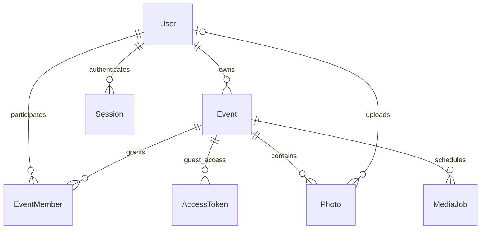

# Архитектура и план

Предыдущие ICT-материалы не доступны в текущем контексте. Эта модель основана
на требованиях из текущего задания. Референс пока не удалось открыть.

## ER-модель

Полные поля и индексы: `prisma/schema.prisma`. Фото гостя имеет nullable uploaderId.
Пароли хешируются Argon2id, токены — SHA-256 от криптографически случайного значения;
в БД не сохраняются сырые токены. Cookie: HttpOnly, Secure в production, SameSite=Lax.
AccessToken — отдельная сессия гостя после ввода пароля альбома. accessVersion
позволяет отозвать все гостевые сессии после изменения пароля или доступа.
Пароль аккаунта допускает 8–128 символов, пароль альбома — 3–128 символов.
Photo.reservedBytes хранит резерв оригинала и превью до финализации загрузки;
Event.reservedBytes и usedStorageBytes изменяются под блокировкой строки события.

ADMIN управляет системой. ORGANIZER управляет собственными/назначенными событиями.
PHOTOGRAPHER может загружать и модерировать только назначенные события, но не
менять владельца, участников или настройки доступа. Все права проверяются сервером
при чтении фото, создании подписанных ссылок, загрузке, экспорте и изменении данных.
Глобальная роль фотографа сама по себе не открывает доступ к чужим событиям.

## Потоки

1. Ссылка `/e/{slug}`, QR или код → событие → проверка срока действия → при необходимости
   пароль → гостевая сессия → опубликованные фото с cursor pagination по 40 записей.
   Превью загружаются лениво; крупный просмотр использует защищённое WebP-превью.
2. Загрузка → проверка Origin, прав и лимита попыток → ограниченное чтение multipart
   → проверка фактического формата JPEG/PNG/WebP, MIME и размеров → Sharp до
   40 мегапикселей → WebP до 1200×1200 без EXIF с учётом ориентации.
   Эта обработка синхронная, внутри HTTP-запроса; на процесс доступно два слота.
   После обработки транзакция с `Event FOR UPDATE` повторно проверяет доступ,
   резервирует общий размер оригинала/превью и создаёт Photo.PROCESSING.
   Оба объекта сохраняются в приватный S3. Финальная транзакция повторно проверяет
   доступ и срок загрузки, переводит фото в PENDING/PUBLISHED и резерв в занятой объём.
   Оригинал остаётся неизменным. Гостевые фото требуют модерации, если она включена.
3. Превью/оригинал → проверка пользователя или гостевого токена, срока и статуса
   публикации → проверка разрешения скачивать оригинал → чтение приватного S3
   → потоковый HTTP-ответ API с `Cache-Control: private, no-store`.
   Клиент не получает S3-ключи или bucket credentials. Подписанные S3-ссылки остаются
   внутренним helper и не используются текущей гостевой галереей.
4. Удаление → Photo.DELETING → удаление оригинала и превью → транзакционное
   освобождение квоты и удаление записи. При ошибке S3 запись и квота сохраняются.
   Отдельный `scripts/media-worker.mjs` каждые 30 секунд обрабатывает до 100
   DELETING и PROCESSING с истёкшим 15-минутным uploadExpiresAt. Проверка состояния
   и освобождение квоты используют блокировку события; повторные удаления
   идемпотентны. `--once` делает один проход для проверок и обслуживания.

Текущий cleanup worker не использует MediaJob: таблица оставлена для будущих ZIP
и других длительных задач. План ZIP: snapshot разрешённых photo IDs → очередь
с lease/retry и `FOR UPDATE SKIP LOCKED` → потоковый архив в приватный S3 → повторная
проверка доступа при выдаче → удаление архива по TTL. ZIP пока не реализован.

Скачивания сейчас — разрешённые выдачи оригиналов через API после успешного
чтения объекта из S3; это не подтверждение завершения передачи клиенту. Просмотры
пока не собираются. В будущем: успешные открытия альбома с дедупликацией за сессию.
Объём учитывает оригиналы и превью, включая резерв незавершённых операций.
Для ZIP потребуется отдельный учёт временного хранилища. BigInt в API — строки.

## Хранилище и процессы

Локально применяется SeaweedFS 4.48: проверенный SHA-256 официальный Linux amd64
бинарник для запуска без `sudo` или официальный Docker-образ с закреплённым digest.
S3 слушает `127.0.0.1:9000`; ключи берутся из `.env` в приватную статическую
конфигурацию с доступом только к bucket проекта. Данные/config/log native-варианта
хранятся в игнорируемом `.data/storage/`; Docker использует volume `seaweed`.
Для проверки подписанных операций и запрета анонимного доступа: `storage:check`.
Источник конфигурации: [официальные S3 Credentials](https://github.com/seaweedfs/seaweedfs/wiki/S3-Credentials).

Native запуск: `storage:dev`, `npm run dev` и `worker:media` в отдельных терминалах.
Production Compose запускает `app` и `worker` с общими DATABASE_URL/S3 credentials;
override заменяет оба S3 endpoint на managed R2/AWS S3 и отключает локальное хранилище.
Worker не открывает HTTP-порт. Миграции применяются отдельным release шагом.

## Последовательность реализации и критерии готовности

1. **Основа (готово):** схема, конфигурации, стартовая страница, lockfile,
   Prisma validate, начальная миграция и сборка. PostgreSQL подключён и проверен.
2. **Авторизация организатора (реализовано):** регистрация, вход/выход,
   сессии на 7 дней, защищённый кабинет, проверка Origin, размера JSON и лимит
   попыток в таблице AuthRateLimit. Проверены HTTP-сценарии истечения/отзыва
   сессий, отключённого пользователя и конкурентного превышения лимита.
   Bootstrap администратора и управление участниками остаются следующими задачами.
3. **События (создание/чтение/редактирование готово):** уникальные slug и случайный
   код, QR PNG, пароль, квоты, срок жизни. Гостевой маршрут `/e/slug` и поиск
   по коду `/join`, гостевые сессии на 24 часа с отзывом при смене доступа.
   Удаление событий с очисткой медиа и поддомены `slug.domain` остаются будущими этапами.
4. **Медиа (реализовано):** загрузка по одному файлу из выбранной партии, проверка
   содержимого, синхронные thumbnails, модерация, удаление и cleanup worker.
   HTTP/БД/S3-проверки охватывают доступ, форматы, оригиналы, закрытые превью,
   конкурентные квоты и освобождение места; браузерные проверки — гостевой сценарий.
5. **Гостевая галерея (базовый сценарий реализован):** адаптивная сетка, lazy loading,
   крупное превью, гостевая загрузка и оригинал. ZIP остаётся следующим этапом.
6. **Dashboard (базовый сценарий реализован):** события, массовые операции с фото,
   настройки доступа, занятый объём и выдачи оригиналов, ошибки/пустые альбомы.
   Фильтры фото, учёт просмотров и управление участниками будут добавлены отдельно.
7. **Production:** интеграционные тесты с Postgres/S3, Playwright, проверка размера
   изображений/ZIP и нагрузки, lockfile/audit, CI, миграции, backup/restore,
   мониторинг, SSL, проверка на реальном домене.

В текущем коде действуют rate limiting входа/паролей/загрузок, проверка Origin,
приватный S3, запрет SVG/HTML/анимированных изображений и атомарные квоты, включая
количество фото. Перед публичным выпуском остаются нагрузочные и Docker runtime
проверки, мониторинг, журнал административных операций и backup/restore.
