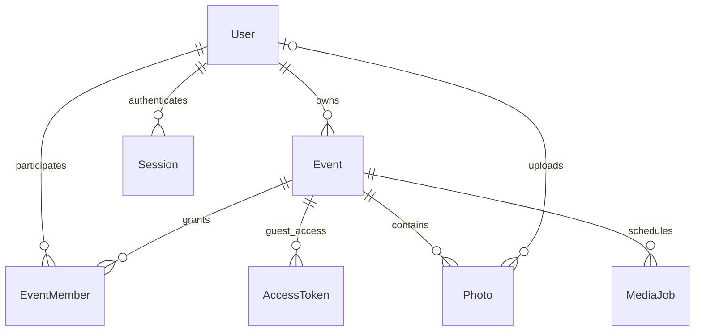

# Архитектура и план

Предыдущие ICT-материалы не доступны в текущем контексте. Эта модель основана
на требованиях из текущего задания. Референс пока не удалось открыть.

## ER-модель

Полные поля и индексы: `prisma/schema.prisma`. Фото гостя имеет nullable uploaderId.
Пароли хешируются Argon2id, токены — SHA-256 от криптографически случайного значения;
в БД не сохраняются сырые токены. Cookie: HttpOnly, Secure в production, SameSite=Lax.
AccessToken — отдельная сессия гостя после ввода пароля альбома. accessVersion
позволяет отозвать все гостевые сессии после изменения пароля или доступа.

ADMIN управляет системой. ORGANIZER управляет собственными/назначенными событиями.
PHOTOGRAPHER может загружать и модерировать только назначенные события, но не
менять владельца, участников или настройки доступа. Все права проверяются сервером
при чтении фото, создании подписанных ссылок, загрузке, экспорте и изменении данных.
Глобальная роль фотографа сама по себе не открывает доступ к чужим событиям.

## Потоки

1. Ссылка `/e/{slug}`, QR или код → событие → проверка срока действия → при необходимости
   пароль → гостевая сессия → опубликованные фото с cursor pagination.
2. Загрузка → проверка прав и квоты в транзакции → резерв места → объект в quarantine
   → проверка фактического размера, MIME по содержимому и размеров изображения
   → Sharp с лимитом пикселей → preview WebP без EXIF → pending/published.
   Оригинал остаётся неизменным. Превью приватных альбомов также защищены.
3. Скачивание → проверка доступа → signed GET на 60 секунд. ZIP → задача с snapshot
   разрешённых photo IDs → потоковая запись архива в приватный S3 → повторная
   проверка доступа при выдаче ссылки → удаление ZIP по TTL.
4. Worker забирает MediaJob через `FOR UPDATE SKIP LOCKED`, использует lease/retry,
   восстанавливает задачи после сбоя. Удаление идемпотентно, квота освобождается
   после удаления файлов. Просроченные незавершённые загрузки очищаются.

Просмотры — успешные открытия альбома с дедупликацией за сессию. Скачивания —
выданные ссылки, а не гарантированно завершённые передачи. Для точной статистики
передач нужен анализ логов S3/CDN. Объём учитывает оригиналы и превью; ZIP учитывается
отдельно как временное хранилище. BigInt передаётся в API строками.

## Последовательность реализации и критерии готовности

1. **Основа (готово):** схема, конфигурации, стартовая страница, lockfile,
   Prisma validate, начальная миграция и сборка. PostgreSQL подключён и проверен.
2. **Авторизация организатора (реализовано):** регистрация, вход/выход,
   сессии на 7 дней, защищённый кабинет, проверка Origin, размера JSON и лимит
   попыток в таблице AuthRateLimit. Проверены HTTP-сценарии истечения/отзыва
   сессий, отключённого пользователя и конкурентного превышения лимита.
   Bootstrap администратора и управление участниками остаются следующими задачами.
3. **События (создание/чтение/редактирование готово):** уникальные slug и случайный
   код, QR PNG, пароль, квоты, срок жизни. Гостевой маршрут `/e/slug` и поиск
   по коду `/join`, гостевые сессии на 24 часа с отзывом при смене доступа.
   Удаление событий с очисткой медиа и поддомены `slug.domain` остаются будущими этапами.
4. **Медиа:** bulk upload, проверка файлов, worker, thumbnails, модерация,
   удаление, компенсация неудачных загрузок. Тест конкурентного превышения квоты.
5. **Гостевая галерея:** mobile-first, lazy loading, просмотр полноэкранно,
   гостевая загрузка, оригинал и ZIP; сквозной сценарий организатор → гость.
6. **Dashboard:** события, фильтры фото, массовые операции, показатели,
   настройки доступа и состояния ошибок/пустых альбомов.
7. **Production:** интеграционные тесты с Postgres/S3, Playwright, проверка размера
   изображений/ZIP и нагрузки, lockfile/audit, CI, миграции, backup/restore,
   мониторинг, SSL, проверка на реальном домене.

До открытия публичного доступа: rate limiting для входа, паролей альбомов и загрузок;
проверка Origin на мутациях; закрытый bucket; запрет SVG/HTML uploads; ограничение
параллельности worker; журнал административных операций. Квоты должны резервироваться
атомарно, включая количество фото, иначе параллельные запросы обходят лимиты.
