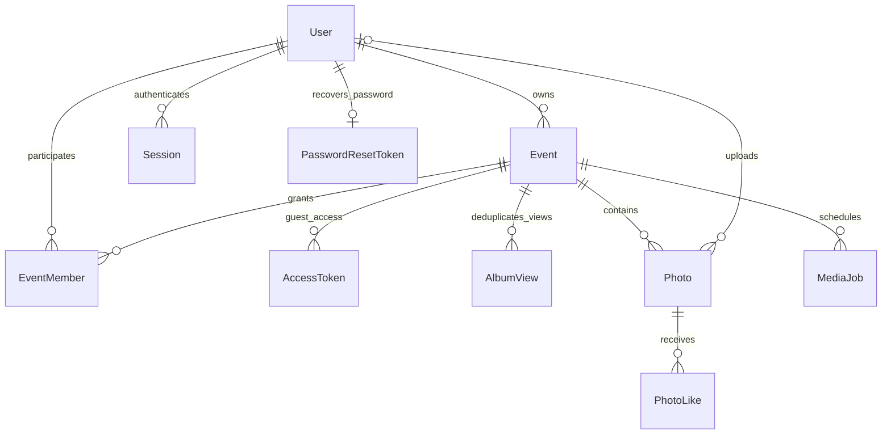

# Архитектура и план

Предыдущие ICT-материалы не доступны в текущем контексте. Эта модель основана
на требованиях из текущего задания. Референс пока не удалось открыть.

## ER-модель

Полные поля и индексы: `prisma/schema.prisma`. Фото гостя имеет nullable uploaderId.
Пароли хешируются Argon2id, токены — SHA-256 от криптографически случайного значения;
в БД не сохраняются сырые токены. Cookie: HttpOnly, Secure в production, SameSite=Lax.
AccessToken — отдельная сессия гостя после ввода пароля альбома. accessVersion
позволяет отозвать все гостевые сессии после изменения пароля или доступа.
Event.mediaVersion меняется при изменении опубликованного состава фото;
MediaJob хранит снимок идентификаторов фото и обе версии для ZIP.
Гостевые загрузки при allowGuestUploads=true публикуются сразу после обработки.
Legacy-поле moderateUploads сохранено для совместимости, но не включает предварительное
подтверждение: API нормализует его к false. Миграция публикует прежние PENDING и
увеличивает mediaVersion затронутых событий; HIDDEN остаются скрытыми.
accessVersion не меняется, поскольку пароль и разрешения доступа сохраняются.
PhotoLike имеет уникальную пару photoId/voterHash; сырые идентификаторы голосующих
в этой таблице не сохраняются.
AlbumView имеет составной ключ eventId/visitorHash, lastCountedAt с часовым поясом
и индекс времени для очистки; удаление события каскадно удаляет эти записи.
Это временное состояние дедупликации, а Event.viewCount — накопленный счётчик.
Пароль аккаунта допускает 8–128 символов, пароль альбома — 3–128 символов.
Photo.reservedBytes хранит резерв оригинала и превью до финализации загрузки;
Event.reservedBytes и usedStorageBytes изменяются под блокировкой строки события.

ADMIN открывает `/admin`: управление пользователями, ролями и блокировками,
поиск всех альбомов и общая статистика сервиса. Новые аккаунты получают ORGANIZER;
первого ADMIN назначает оператор через `admin:bootstrap` для существующего аккаунта.
Смена роли/блокировка отзывают сессии и ссылки восстановления, сохраняя пароль/альбомы.
Изменения набора ADMIN сериализуются advisory lock PostgreSQL; роли действующего
оператора и его сессия проверяются повторно после блокировок. Свой доступ менять
нельзя; последний активный ADMIN защищён. Это не права Linux/SSH.
ORGANIZER управляет собственными/назначенными событиями.
PHOTOGRAPHER может загружать и модерировать только назначенные события, но не
менять владельца, участников или настройки доступа. Все права проверяются сервером
при чтении фото, создании подписанных ссылок, загрузке, экспорте и изменении данных.
Глобальная роль фотографа сама по себе не открывает доступ к чужим событиям.

## Потоки

1. Ссылка `/e/{slug}`, QR или код → событие → проверка срока действия → при необходимости
   пароль → гостевая сессия → опубликованные фото с cursor pagination по 40 записей.
   Превью загружаются лениво; крупный просмотр использует защищённое WebP-превью.
2. Загрузка → проверка Origin, прав и лимита попыток → ограниченное чтение multipart
   → проверка фактического формата JPEG/PNG/WebP, MIME и размеров → Sharp до
   40 мегапикселей → WebP до 1200×1200 без EXIF с учётом ориентации.
   Эта обработка синхронная, внутри HTTP-запроса; на процесс доступно два слота.
   После обработки транзакция с `Event FOR UPDATE` повторно проверяет доступ,
   резервирует общий размер оригинала/превью и создаёт Photo.PROCESSING.
   Оба объекта сохраняются в приватный S3. Финальная транзакция повторно проверяет
   доступ и срок загрузки, переводит фото в PUBLISHED и резерв в занятой объём.
   Оригинал остаётся неизменным. Гостевые фото публикуются сразу, если загрузка гостей
   разрешена; скрывать, удалять или возвращать фото в галерею может только команда события.
3. Превью/оригинал → проверка пользователя или гостевого токена, срока и статуса
   публикации → проверка разрешения скачивать оригинал → чтение приватного S3
   → потоковый HTTP-ответ API с `Cache-Control: private, no-store`.
   Клиент не получает S3-ключи или bucket credentials. Подписанные S3-ссылки остаются
   внутренним helper и не используются текущей гостевой галереей.
4. Удаление → Photo.DELETING → удаление оригинала и превью → транзакционное
   освобождение квоты и удаление записи. При ошибке S3 запись и квота сохраняются.
   Отдельный `scripts/media-worker.mjs` каждые 30 секунд обрабатывает до 100
   DELETING и PROCESSING с истёкшим 15-минутным uploadExpiresAt. Проверка состояния
   и освобождение квоты используют блокировку события; повторные удаления
   идемпотентны. `--once` делает один проход для проверок и обслуживания.
5. Лайк → желаемое состояние `PUT {liked: boolean}` → проверка доступа и PUBLISHED
   под блокировкой события → создание уникальной пары фото/голосующий или её удаление.
   Гость получает случайную HttpOnly cookie на год; вошедший участник использует
   идентичность аккаунта между сессиями. Хеши разных типов не пересекаются.
   Аккаунт гостю не нужен. Другой браузер или очищенная cookie дают новую идентичность,
   поэтому эта схема не защищает от накрутки. Повторная установка состояния идемпотентна.
6. ZIP → проверка доступа и лимитов → снимок опубликованных photo IDs, mediaVersion
   и accessVersion → MediaJob. Под блокировкой события повторный запрос использует
   текущую неистёкшую QUEUED/RUNNING/DONE задачу. Срок — один час с постановки в очередь,
   по умолчанию до 1 ГБ исходных данных и 10000 фото, максимум 10 активных задач в сервисе.
   Worker получает одну задачу через `FOR UPDATE SKIP LOCKED`, lease на 10 минут
   и уникальный lockToken. Heartbeat раз в 30 секунд продлевает lease; все изменения
   состояния проверяют lockToken. Ошибки хранилища повторяются с задержкой до трёх
   попыток; истёкший lease позволяет другому worker продолжить задачу с новым ключом.
   До сборки и перед DONE проверяются срок события/задачи, версии, PUBLISHED и ключи фото.
   Оригиналы читаются последовательно и записываются без повторного сжатия через yazl
   и S3 multipart upload, с ограниченным буфером в памяти и безопасными уникальными
   Unicode-именами, без временных файлов. Выдача через API повторно проверяет доступ,
   срок, версии и опубликованный состав. S3-ключ архива клиенту не передаётся.
7. Успешная загрузка начальной гостевой галереи в браузере →
   `POST /api/albums/{slug}/view` с пустым JSON `{}` и проверкой Origin.
   Успешный GET галереи устанавливает случайную HttpOnly visitor cookie;
   без корректной cookie POST возвращает 409 и не создаёт идентичность сам.
   Сервер вновь проверяет гостевой доступ под блокировкой события, затем условный
   upsert AlbumView вставляет запись или меняет lastCountedAt только спустя
   24 часа после последнего учтённого просмотра. Возвращённая запись означает,
   что Event.viewCount увеличивается в той же транзакции. PostgreSQL задаёт время;
   повторы и конкурентные запросы не создают дополнительного просмотра и не
   продлевают окно. Успешная загрузка пустого альбома также учитывается.
   Пагинация, кабинет команды, GET и prefetch не добавляют просмотров;
   ошибки, альбом без подтверждённого пароля, удалённый и истёкший альбом не учитываются.
   Организатор на гостевой странице использует те же правила, без обхода пароля.

Worker каждые две секунды ищет ZIP и удаляет истёкшие/недействительные архивы,
включая orphan objects под префиксом задачи и незавершённые multipart uploads.
Очистка фотографий и AlbumView старше 24 часов запускается при очередном проходе
обслуживания, обычно раз в 30 секунд; длительный ZIP может отложить этот проход.
Удаление AlbumView не меняет накопленный счётчик. В этом же проходе удаляются
истёкшие AuthRateLimit с префиксом `view:`, чтобы не сохранять хеши браузеров
после окна ограничения запросов; активные и остальные rate counters не затрагиваются.
После успешной очистки
истёкшего ZIP удаляется payload со списком фото; небольшой tombstone задачи удаляется
через 7 дней. При ошибке S3 запись и ключ сохраняются для повторной очистки.

Скачивания сейчас — разрешённые выдачи оригиналов и ZIP через API после успешного
чтения объекта из S3; ZIP увеличивает счётчик события на один и каждого включённого
фото на один. Это не подтверждение завершения передачи клиенту.
Просмотры — успешные открытия гостевой галереи по браузерам, не более одного
на альбом за скользящие 24 часа. Для гостей используется тот же хеш cookie,
что для лайков; вошедший пользователь на гостевой странице тоже учитывается
по браузеру. IP и сырые токены в AlbumView не сохраняются. Это не число уникальных
людей и не защита от накрутки: очищенная cookie или новый браузер меняют идентичность.
Объём учитывает оригиналы и превью, включая резерв незавершённых операций.
MediaJob.sizeBytes отдельно учитывает фактический объём временных ZIP; он не входит
в квоту оригиналов/превью альбома. Сроки и очистка ограничивают их хранение;
свободный объём S3 нужно контролировать отдельно. BigInt в API — строки.

## Хранилище и процессы

Локально применяется SeaweedFS 4.48: проверенный SHA-256 официальный Linux amd64
бинарник для запуска без `sudo` или официальный Docker-образ с закреплённым digest.
S3 слушает `127.0.0.1:9000`; ключи берутся из `.env` в приватную статическую
конфигурацию с доступом только к bucket проекта. Данные/config/log native-варианта
хранятся в игнорируемом `.data/storage/`; Docker использует volume `seaweed`.
Для проверки подписанных операций и запрета анонимного доступа: `storage:check`.
Источник конфигурации: [официальные S3 Credentials](https://github.com/seaweedfs/seaweedfs/wiki/S3-Credentials).

Native запуск: `storage:dev`, `npm run dev` и `worker:media` в отдельных терминалах.
Production Compose запускает `app` и `worker` с общими DATABASE_URL/S3 credentials;
override заменяет оба S3 endpoint на managed R2/AWS S3 и отключает локальное хранилище.
Worker не открывает HTTP-порт. Миграции применяются отдельным release шагом.
S3 credentials должны разрешать операции с объектами, `ListBucket`,
`ListBucketMultipartUploads` и `AbortMultipartUpload` в bucket проекта;
публичный доступ к объектам запрещён.

## Последовательность реализации и критерии готовности

1. **Основа (готово):** схема, конфигурации, стартовая страница, lockfile,
   Prisma validate, начальная миграция и сборка. PostgreSQL подключён и проверен.
2. **Авторизация организатора (реализовано):** регистрация, вход/выход,
   сессии на 7 дней, защищённый кабинет, проверка Origin, размера JSON и лимит
   попыток в таблице AuthRateLimit. Проверены HTTP-сценарии истечения/отзыва
   сессий, отключённого пользователя и конкурентного превышения лимита.
   Одноразовое восстановление пароля оператором, bootstrap ADMIN и панель управления
   пользователями реализованы. Назначение участников события остаётся следующей задачей.
3. **События (создание/чтение/редактирование готово):** уникальные slug и случайный
   код, QR PNG, пароль, квоты, срок жизни. Гостевой маршрут `/e/slug` и поиск
   по коду `/join`, гостевые сессии на 24 часа с отзывом при смене доступа.
   Удаление событий с очисткой медиа и поддомены `slug.domain` остаются будущими этапами.
4. **Медиа (реализовано):** загрузка по одному файлу из выбранной партии, проверка
   содержимого, синхронные thumbnails, немедленная публикация гостевых фото,
   скрытие/повторная публикация командой, удаление и cleanup worker.
   HTTP/БД/S3-проверки охватывают доступ, форматы, оригиналы, закрытые превью,
   конкурентные квоты и освобождение места; браузерные проверки — гостевой сценарий.
5. **Гостевая галерея (базовый сценарий реализован):** адаптивная сетка, lazy loading,
   крупное превью, гостевая загрузка, оригинал, лайки и ZIP с прогрессом.
   HTTP/БД/S3-проверки `test:engagement` охватывают идемпотентность лайков,
   приватность, состав архивов, версии, expiry, lease/retry и очистку.
6. **Dashboard (базовый сценарий реализован):** события, массовые операции с фото,
   настройки доступа, занятый объём, просмотры и выдачи оригиналов/ZIP,
   ошибки/пустые альбомы. `test:views` проверяет гостевой доступ, повторные и
   конкурентные запросы, границу 24 часов и очистку без сброса счётчика.
   Фильтры фото и управление участниками будут добавлены отдельно.
7. **Production:** интеграционные тесты с Postgres/S3, Playwright, проверка размера
   изображений/ZIP и нагрузки, lockfile/audit, CI, миграции, backup/restore,
   мониторинг, SSL, проверка на реальном домене.

В текущем коде действуют rate limiting входа/паролей/загрузок, проверка Origin,
приватный S3, запрет SVG/HTML/анимированных изображений и атомарные квоты, включая
количество фото. Перед публичным выпуском остаются нагрузочные и Docker runtime
проверки, мониторинг, журнал административных операций и backup/restore.
